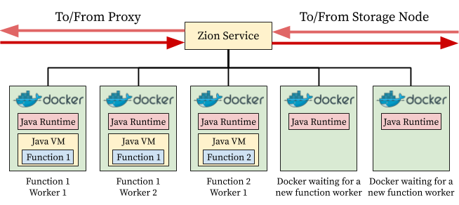

<p align="center"> </p>

Zion is a Serverless Computing Framework for OpenStack Swift that allows to run storage functions directly on the data. It aims to solve the scalability and resource contention problems of active storage, while benefiting from data locality to reduce latency by placing computations close to the data. Our model is data-driven and not event-driven, because ZIon computations are located in the data pipeline, and intercept the data flows that arrive and return from the object store.


## Architecture


### Interception Software and Metadata Service
We built a new Swift interception middleware for Zion to accomplish two primary tasks: 1. The management of function code deployment and libraries, including the triggers that cause the functions to be run; and 2. Redirection of requests and responses through the computation layer when they need to be processed by any function

### Computation layer

In Zion, the computation layer is composed by a pool of compute nodes. They are located between the proxies and the storage nodes. In a compute node, each function is run inside a separate Docker container, what is called a *worker*. Zion’s runtime is Java-based, and consequently, every function is run in a Java Virtual Machine (JVM). At a very high level, a worker can be viewed as a container running a specific function. Every new invocation to the function is handled by a new thread inside the JVM of a worker. This means that a single worker can handle more than one request at a time. By default, each worker uses 1 exclusive CPU, then a service called *Zion Service Manager* is responsible to monitor the function workers and scale them up and down depending of the CPU usage.

<p align="center"> </p>

## Installation

### All-In-One Machine
For testing purposes, it is possible to install an All-In-One (AiO) machine with all the Zion components and requirements.
We prepared a script for automating this task. The requirements of the machine are a clean installation of **Ubuntu Server 20.04**, **2CPU Cores**, at least **2GB** of RAM, and a **fixed IP address**. It is preferable to upgrade the system to the latest versions of the packages with `apt update && apt dist-upgrade` before starting the installation, and set the server name as `controller` in the `/etc/hostname` file. Then, download the `aio_u20_ussuri.sh` script and run it as sudo:

```bash
curl -fsSL https://git.io/JJq4t | sudo bash /dev/stdin install aio
```

The script first installs Keystone, Swift and Horizon (Ussuri release), then it proceeds to install the Zion framework package. Note that the script uses weak passwords for the installed services. If you want more secure services, please change them at the top of the script.

By default, the script has low verbosity. To see the full installation log, run the following command in another terminal:

```bash
tail -f /tmp/zion_aio_installation.log
```

The script takes long to complete (~10 minutes) (it depends of the network connection). Once completed, you can access to the dashboard by typing the following URL in the web browser: `http://<node-ip>/horizon`.

If you already ran the installation script, you can update the Zion framework from this repository by the following command:

```bash
curl -fsSL https://git.io/JJq4t | sudo bash /dev/stdin update aio
```

## Verify
### Test Swift
To verify the correct operation of the Swift installation, follow these steps:

1- Load credentials:
```bash
source zion-openrc
```

2- Create data bucket:
```bash
swift post data
```

3- Create new .json file and upload it to data bucket:
```bash
echo test > test.json
swift upload data test.json
```

4- Test if you can download the .json file:
```bash
swift download data test.json
or
curl -H "X-Auth-Token:$TOKEN" $STORAGE_URL/data/test.json
```


### Test Zion
Navigate into [Function Samples](Function%20Samples/java), and compile and deploy the *NoopDataIterator* storage function by using the [deployment script](Utils/deploy_function.py).

1- Assign the No-operation storage function to the .json file upon GET requests:
```bash
curl -H "X-Auth-Token:$TOKEN" $STORAGE_URL/data/test.json -X POST -H "X-Function-onGet:noop.tar.gz"
```

2- Download the .json file that will put into execution the storage function:
```bash
swift download data test.json
or
curl -H "X-Auth-Token:$TOKEN" $STORAGE_URL/data/test.json
```

3- Delete the No-operation storage function:
```bash
curl -H "X-Auth-Token:$TOKEN" $STORAGE_URL/data/test.json -X POST -H "X-Function-onGet-Delete:noop.tar.gz"
```

Navigate into [Function Samples](Function%20Samples/java), and compile and deploy the *Counter* storage function by using the [deployment script](Utils/deploy_function.py).

4- Assign the Counter storage function to the .json file upon GET requests:
```bash
curl -H "X-Auth-Token:$TOKEN" $STORAGE_URL/data/test.json -X POST -H "X-Function-onGet:access-counter.tar.gz"
```

5- Download the .json file that will put into execution the storage function:
```bash
swift download data test.json
or
curl -H "X-Auth-Token:$TOKEN" $STORAGE_URL/data/test.json
```

6- The Counter storage function adds into the object metadata an access counter and the last access timestamp. Verify the correct execution of the storage function by running the following command:
```bash
swift stat data test.json
```

## See also

"[Data-driven Serverless Functions for Object Storage](https://dl.acm.org/doi/abs/10.1145/3135974.3135980)" by Josep Sampé, Marc Sánchez-Artigas, Pedro García-López and Gerard París. Proceedings of the 18th ACM/IFIP/USENIX Middleware Conference (Middleware 17), December 2017, Las Vegas, Nevada.
